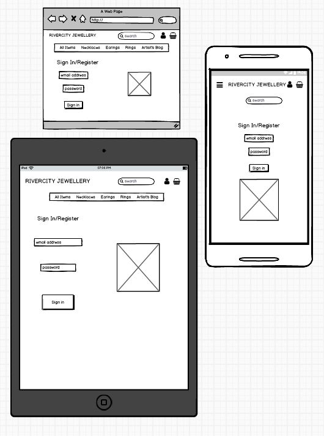
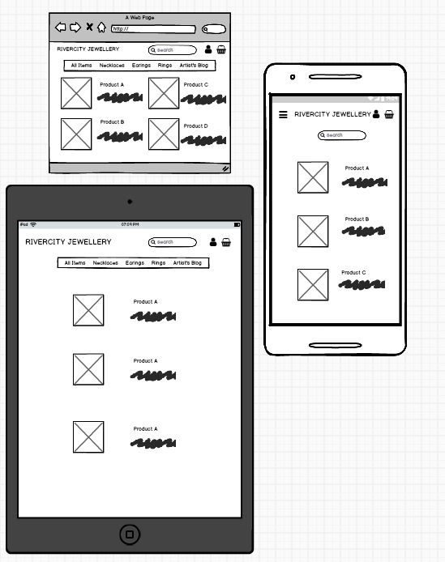
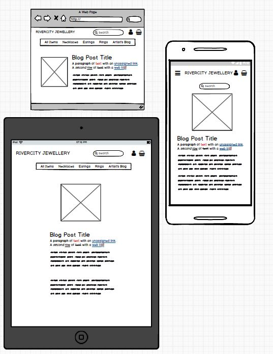

# **Rivercity Jewellery**

View live project [here](https://rivercity-jewellery.herokuapp.com/) 

# Table of Contents

1. [User Experience](#user-experience(ux))
  - [User Stories](#user-stories)
  - [Design](#design)
    - [Colour Scheme](#colour-scheme)
    - [Typography](#typography)
    - [Imagery](#imagery)
2. [Wireframes](#wireframes)
3. [Features](#features)
  - [Existing Features](#existing-features)
    - [Features On All Pages](#features-on-all-pages)
    - [Features Of Individual Pages](#features-of-individual-pages)
  - [Features Left To Implement](#features-left-to-implement)
4. [Technologies Used](#technologies-used)
  - [Front-End Technologies](#front-end-technologies)
  - [Back-End Technologies](#back-end-technologies)
  - [Database Schema](#database-schema)
5. [Testing](#testing)
  - [Validator Testing](#validator-testing)
  - [Functional Testing](#functional-testing)
6. [Deployment](#deployment)
  - [Local Deployment](#local-deployment)
  - [Remote Deployment](#remote-deployment)
7. [Content](#content)
  - [Media](#media)
  - [Credits](#credits)

# User Experience (UX)

## User Stories

### As a site user, I want to be able to:
- Easily register for an account, so that I can be able to have a personal account and be able to view my profile 
- Easily login and logout, so that I can access my personal account and easily logout to quit the session
- Have a personalised user account so that I can view my personal order history and order confirmations, and save my payment information
- Easily navigate to the blog so that I can read the latest blog posts
- See short descriptions of each blog, so that I can quickly decide which blog post I would like to read
- Easily navigate to the blog post details so that I can read the full blog post to learn new information about jewellery
- Easily leave comments, pending approval by the site user so that I can express my thoughts on the blog post 

### As a site owner, I want to be able to:
- Easily add new products to sell, so that I can keep my store reflecting new products in my inventory
- Easily edit/update existing products that are listed, so that I can keep my products listing up to date with the correct information 
- Quickly delete products should they no longer be available to the shopper, so that I can make sure the shopper does not select a product that is no longer available 
- Easily create new blog post, edit existing blog posts and delete blog posts, so that I can keep my blog up to date with new posts and delete post that may no longer be relevant

### As a shopper, I want to be able to:
- Sort the list of available products so that I can easily identify the best rated, best priced and categorically sorted products
- Sort a specific category of product so that I can find the best rated or best priced product within a specific category
- Sort multiple categories of products simultaneously so that I can find the best rated or best priced product within a specific category such as 'rings' or 'necklaces'
- Sort for a product by name, description and artist so that I can Find a specific product with known keywords
- Easily see what I have searched for so that I can quickly see if the product I have searched for is available
- Easily select the quantity of a product when purchasing it so that I can ensure I dont select the wrong product, or quantity
- Adjust the quantity of items I would like to buy, so that I can make sure that I am buying the desired amount
- Easily see the subtotal for each item, so that I can get an idea of how much I am spending on each item 
- Safely and securely use my card details to make the payment, so that I can have peace of mind that the payment is safe
- Save my details on the site, so that I can be a return shopper without the hassle of re-entering all of my details 
- View an order confirmation after checkout, so that I can verify that I have not made any mistakes
- Receive an email confirmation after checkout, so that I can keep the confirmation of what I have purchased in my records

## Design

### Colour Scheme

### Typography

### Imagery

## Wireframes

- Home: 
- Sign In/Register: 
- Products: 
- Product Details: 
- Checkout: 
- Blog: 
- BLog Details: 
 

The current site layout is different to the wireframes due to a change in image choices and colour scheme.

# Features

## Existing Features 

### Features on all pages

#### Navbar
The responsive navigation bar contains four main sections. The first is the Rivercity Jewellery logo which is just a heading, following the logo link to navigate the user back to the landing page. 

The second section is the search bar, where the user can search for products by their name and description.

The next section is the details for My Account page, with the dropdown menu directing the superuser to the Product and Blog management form, if the user is not a superuser, they can direct themselves to their Profile page or to log out. Then the Shopping cart is included, the user should be able to see the monetary value of the products they have added to their cart. 

If the user is visiting the site and would like to register they can do so via the ‘My Account’ button. They will register themselves with their email address and receive an email confirmation once they have registered, the email confirmation will contain the link they need to follow to completely sign in. 

The fourth section is the product navigation section. Where the user can navigate to different product categories. The user will also be able to navigate through to the Blog section. 

 
#### Footer 
The footer was included to keep up with standard site navigation. The links to the social media accounts can be used to direct the user to the sites relevant social media. This footer also includes a quick copyright write up as this project is only for educational purposes. 

### Features of individual pages

#### Home Page 
The hero image is that of a woman swimming in dark water with attention drawn to a gold chain and pendant. I feel that this image plays well to the name of the store. 

You will find two call to action buttons on the landing page. The ‘Shop Now’ button directs the user to the All products page. The ‘Artist’s Blog’ page directs the user to the blog list 

#### Products Pages
The products page allows the user to see exactly which products are for sale. The products can be sorted by price, rating, name or category. Users can click on the product image to navigate to the product details page. They can then add the product to their shopping cart and proceed to checkout should they wish. 

Superusers can update the details of a product easily either by clicking the delete button found under the items on the Product Details page, and then amending the form.
 
#### Blog Page
The blog app currently has 3 blog posts. When navigating to the blog page, the user will see a list of the blog posts. An image for each blog post has been included. As more blog posts are added by the superuser/site owner the user will be able to see them. Should the user click on the ‘See More’ button, they will be directed to the blog details page where they can read the blog post with more detail. 

The user will be able to leave comments on each of the blog posts in the blog details page. The comments will be approved by the site owner and can be deleted at any time. 

The blog posts can also be edited and deleted by the superuser. This allows the site owner to be able to make changes to the blog list as they see fit. 

#### Profile Page 
Users will be able to navigate to their Profile page via the navigation bar at the top of site. This page is where they will be able to update their profile details like their shipping address and full name. Users will also be able to see an order history details. If they have made purchases before, they will be able to see then here, if not the order history will be empty. 

#### Checkout
Similar to the Profile page, this is where the user will be able to confirm the shipping address. The user will be prompted to fill out their information to complete the order here. The user will also be able to order a summary, including the quantity per product they are purchasing, the subtotal per product and then the grand total of their order. I have implemented Stripe to manage payments. Once the order has been completed and payment has been processed, the user will receive an email confirmation. 

## Features Left To Implement 
- Defensive delete button: Currently, the Delete button to delete a product has no defence to stop it being accidentally/automatically pressed. A confirmation of delete should be added.

- Leave reviews beneath products: Reading reviews are a great way to help users decide to purchase a product. This feature would be great to include in the future but was not seen as imperative for launch.

# Technologies Used

## Front-End Technologies
- [HTML](https://html.com/)
- [CSS](https://www.w3.org/Style/CSS/Overview.en.html)
- [JQuery](https://jquery.com/) to simplify DOM manipulation.
- [Stripe](https://stripe.com/) as a payment platform to validate and accept credit card payments securely.
- [AWS S3](http://aws.amazon.com/) to store images held in the database
- [MDBoostrap](https://mdbootstrap.com/) a front end framework used to create responsive aspects across the site.
- [Bootstrap](https://getbootstrap.com/) 4 to help with other responsive aspects of the site.

## Back-End Technologies
- [Python](https://www.python.org/) The backend programming language
- [Django 3.0](https://docs.djangoproject.com/en/3.0/releases/3.0/) the backend framework for rapid development & clean designs
- [Heroku](http://heroku.com/) the hosting platform used for deployment
- [PostgreSQL](https://www.postgresql.org/) for production database, provided by heroku.
- [SQLite](https://www.sqlite.org/index.html) for development database, provided by django.

## Other Tools Used
- [Gitpod](http://gitpod.io/) the cloud based IDE used for development
- [Github](https://github.com/) to store and share all project code remotely.
- [Balsamiq](https://balsamiq.com/?gclid=Cj0KCQjwo6D4BRDgARIsAA6uN1-NxDOthq9pGqYzB_1iRxlBvHVwi_4_LaZuGqQT46csctF0xCiTXUMaAqmuEALw_wcB) used to create low fidelity wireframes
- [Google Sheets](https://www.google.com/sheets/about/) Used to create the database schema diagram
- [Unsplash](https://unsplash.com/) used to get the images
- [AutoPep8](https://pypi.org/project/autopep8/) a python add on, to format code into PEP8 formatting.
- [Boto3](https://boto3.amazonaws.com/v1/documentation/api/latest/index.html) to enable the creation, configuration, and management of AWS S3.
- [Django allauth](https://django-allauth.readthedocs.io/en/latest/installation.html) to create the signup/login functionality across the site.
- [Django Crispy Forms](https://django-crispy-forms.readthedocs.io/en/latest/) to style Django forms.
- [Django Storages](https://django-storages.readthedocs.io/en/latest/) a collection of custom storage backends with Django to work with boto3 and AWS S3.
- [Gunicorn](https://pypi.org/project/gunicorn/) WSGI HTTP Server for UNIX to aid in the deployment of the Django project to Heroku.
- [Pillow](https://pillow.readthedocs.io/en/stable/) a python imaging library to aid in processing image files to store in the database.
- [Psycopg2](https://pypi.org/project/psycopg2/) as PostgreSQL database adapter for Python.

## Database Schema

# Testing 

For more information about the testing of this site, please continue to the [testing.md](readme-additions/testing.md) documentation

# Deployment

## Local Deployment 

To run this project on your own IDE, you will need to ensure you have the following in place:

1. Having your own IDE such as [VS Code]() or [Pycharm.]() You will also need to ensure you have [PIP](), [Python3]() and [Git]() installed through the CLI on your machine.

2. In order to access the full functionality of this site, you will also need to have the following set up:
- [Stripe]() (As the site is in development - you will not need to use AWS S3 for this)

3. Then you will need to save a copy of this repository to your computer. This can be done by navigating to this page -https://github.com/lucyrush/rivercity_jewellery  then clicking on the Code dropdown & downloading the .zip file.

4. Then in the CLI, enter the following command:
 - `git clone https://github.com/lucyrush/rivercity_jewellery`
 
5. Open your IDE, unzip the folder downloaded, and use the cd command in the terminal to navigate to the root directory for the project. Install all the required modules using
- `pip -r requirements.txt`

6. Create an env.py file

7. In here, you need to have the following env variables:
- os.environ["SECRET_KEY"] = This key is your Django secret key, that generates when you install Django.
- os.environ["STRIPE_PUBLIC_KEY"] = This key is obtained when you set up stripe.
- os.environ["STRIPE_SECRET_KEY"] = This key is obtained when you set up stripe.
- os.environ["EMAIL_HOST_USER"] = This is your email address
- os.environ["EMAIL_HOST_PASS"] = Your email password generated from apps. A how-to can be found here

8. Migrate your models using :
- `python manage.py migrate`
 
9. You will need to create a superuser using:
- `python3 manage.py createsuperuser`

 
10. Navigate to the admin panel & create the Memberships in order to get the site to function correctly.

11. This should be everything & your site should be running correctly now. You can run the project using
- `python3 manage.py runserver`

## Remote Deployment 

**Section One**

1. Open up Heroku and log your account 
2. Create a new app, called rivercity-jewellery, selecting the location nearest to you. In my case, Europe. 
3. Under the ‘Resources’ tab, search for and add the ‘Heroku Postgress DB’ app
4. In the project terminal, install `dj_database_url` and `psycopg2` by using the following commands: 
- `Pip3 install dj_database_url`
- `Pip3 install psycopg2-binary`
5. Next, freeze the requirements to requirements.txt to make sure Heroku installs all our apps’ requirements when we deploy the project. User the following command: 
- `pip3 freeze > requirements.txt`
6. In settings.py at the top of the file, import the DJ database: `import_dj_database_url`
7. Comment out the current `DATABASE` settings (we will need them again later), and add:
- ‘Default’: dj_database_url.parse( insert database URL here)
8. Add the Database URL into the () which you can find in the Heroku app under Settings > Reveal Config Vars > Database URL
9. Now run all the migrations to get our database set up: 
- `python3 manage.py migrate`
10. Next, create a superuser with the `python3 manage.py createsuperuser`
11. Back in settings.py, remove the new DB settings and uncomment out the original settings. This stops the database URL going into version control. 
12. Update the Database settings in setting.py with an if statement, so that when we are running the app on Heroku it will connect to the database URL, otherwise we connect the site to SQL lite. 

**Section Two**

1. Now to install gunicorn which will act as our web server with the following command
- `pip 3 install gunicorn`
2. Freeze this to your requirements.txt file with the following command
- `pip3 freeze  > requirements.txt`
3. Create a Procfile to tell Heroku to create a web dynamo, which will run unicorn and serve or Django app
4. Add the following to your Procfile 
- `web: gunicorn rivercity_jewellery.wsgi:application`
5. Log into Heroku via the terminal with the following command: 
- `heroku login -i`
6. Temporarily disable collect static using the following command: 
- `heroku config:set DISABLE_COLLECTSTATIC=1 --app rivercity-jewellery`
7. In settings.py, updated the `ALLOWED_HOSTS` settings. `Localhost` allows GitPod to still work too 
- ALLOWED_HOSTS = ['rivercity-jewellery.herokuapp.com', 'localhost']
8. Commit all of these changes to GitHub
9. In Heroku, head to the Deploy Tab, select GitHub from the option, search for rivercity jewellery and clock connect 
10. Then, click `Enable Automatically Deploy`. You can disable automatic deployment should you wish to. 

Tada! Now the site should be deployed! 

# Content

## Media 

## Credits
- https://unsplash.com/photos/s8SJ8pmxPDA?utm_source=unsplash&utm_medium=referral&utm_content=creditShareLink
- https://unsplash.com/photos/zTxp7jb5osM?utm_source=unsplash&utm_medium=referral&utm_content=creditShareLink

